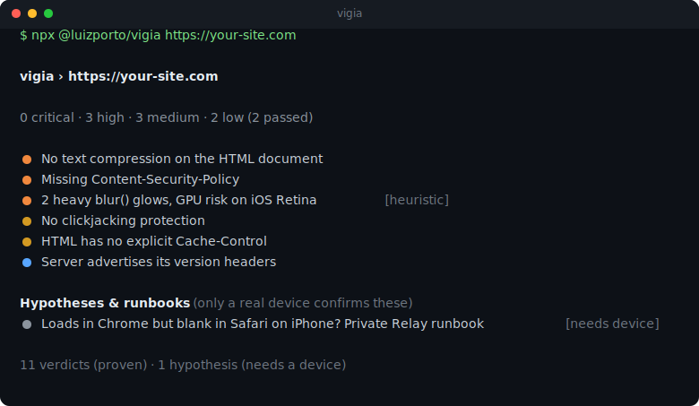

<h1 align="center">vigia</h1>

<p align="center"><b>Your lookout for what breaks before users do.</b></p>

<p align="center">
A framework-agnostic website auditor that's honest about what it can and can't prove.
It checks responsiveness, cross-browser rendering (yes, WebKit/Safari), broken layout,
smoke errors, HTTP delivery, and performance, then hands you one ranked report.<br/>
<b>It diagnoses. It never touches your code.</b>
</p>

<p align="center">
  <a href="https://www.npmjs.com/package/@luizporto/vigia"></a>
  <a href="#license"></a>
  
  
  
</p>

---

## Try it in 5 seconds (no install)

```bash
npx @luizporto/vigia https://your-site.com
```

You get a ranked report: blockers first, warnings next, passes last. Every finding carries
the evidence, a fix, and a link to the source that backs it.

<p align="center"></p>

## What it checks

```
Responsiveness   horizontal overflow, breakpoint sweep, tap-target size, viewport meta
Cross-browser    Chromium, Firefox, WebKit: render, JS errors, missing -webkit- prefixes
Broken layout    off-canvas elements, broken images, zero-size targets
Smoke errors     uncaught JS, console errors, 4xx/5xx assets (the "white screen after deploy")
Delivery / HTTP  compression, caching, security headers, HTTP-to-HTTPS and www redirects
Performance      Lighthouse LCP / CLS / TBT plus a page-weight budget
Accessibility    axe-core smoke: alt text, labels, button names, color contrast
```

## What it is, and what it isn't

Most tools won't say this part out loud, so here it is:

- It's an **auditor**. It finds and ranks problems and points you at the exact spot.
- It's **not a fixer**. It never edits your code, config, or deploys anything.
- It's **WebKit-honest**. It runs real WebKit through Playwright. But headless Linux WebKit
  is not Safari on a real iPhone: no Metal GPU, no CoreText fonts, no iCloud Private Relay.
  Anything it can't reproduce it labels `needs-device` and gives you a runbook, instead of a
  green check you can't trust. Plenty of tools imply Safari coverage and quietly run Chromium.
- It won't catch business-logic bugs, auth-walled flows, or design taste.

Every finding is one of two kinds. A **verdict** is a proven fact. A **hypothesis** is a
strong signal that only a real device can confirm. vigia never passes one off as the other.

## Install

For developers:

```bash
npx @luizporto/vigia <url|dir>              # one-off, no install
npm i -D @luizporto/vigia                   # project dependency

# full cross-browser and performance coverage (once):
npm i -D playwright lighthouse @axe-core/playwright && npx playwright install
```

In CI:

```yaml
# .github/workflows/vigia.yml
- run: npx @luizporto/vigia https://your-site.com --ci --md vigia-report.md
```

`--ci` exits non-zero when any critical or high **verdict** fails.

For AI coding agents (Claude Code, Codex, Cursor):

vigia ships a `SKILL.md` at the repo root. Point your agent at this repo and it learns to run
vigia, read the JSON, rank the findings, turn them into concrete edits, then re-run to confirm
the fix. After that, "audit https://example.com and fix the blockers" just works.

## Usage

```
vigia <url|dir> [options]

  --json [file]   Write JSON report (file, or stdout if omitted)
  --md <file>     Write a Markdown report (good for PR comments)
  --only <ids>    Run only these probes: headers,static,dns,render,perf
  --skip <ids>    Skip probes
  --ci            Exit non-zero on any critical/high verdict failure
```

## How it works

Headless browsers (Playwright, three engines) render the layout and run the JavaScript. Plain
HTTP requests read the delivery headers. A static HTML/CSS pass catches missing prefixes and
heavy blur. Lighthouse runs the performance budget. A DNS delegation snapshot backs the
Safari/Private-Relay runbook. No telemetry, and no network calls except to the site you point
it at.

## Contributing

A check is one file in `src/probes/` that exports `{ id, title, appliesTo, run(ctx) }` and
returns findings. That's the whole extension model, so new checks make good PRs. See
`docs/DESIGN.md` for the architecture and the finding schema.

## License

MIT. See [LICENSE](LICENSE).
